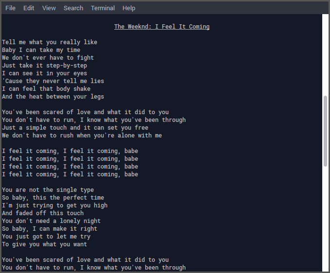

# spotify-lyrics

A Python script that displays the lyrics to the currently playing song on Spotify in your terminal.




## Getting started

### Dependencies

This script requires Python 3, requests and BeautifulSoup4

### Installation and use

1. Save spotify-lyrics.py to a location of your choice (this is where you will run the script from):

    ```
    $ wget https://raw.githubusercontent.com/cjlh/spotify-lyrics/master/spotify-lyrics.py
    ```

2. Run the script whilst playing music in Spotify -- the lyrics will automatically display as the song changes:

    ```
    $ python /path/to/spotify-lyrics.py
    ```

    Or if the script was saved to `/usr/bin`:

    ```
    $ spotify-lyrics
    ```


## License

This project is licensed under the MIT License.

***
[https://github.com/cjlh/spotify-lyrics](https://github.com/cjlh/spotify-lyrics)
